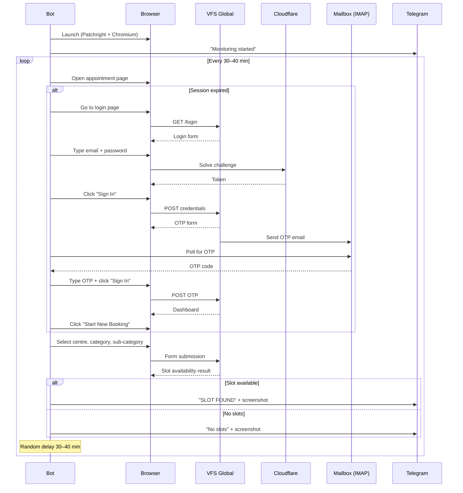
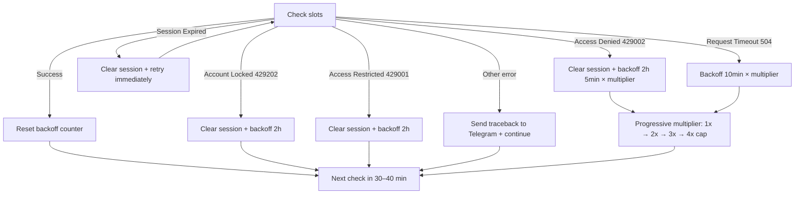

# VFS Slot Monitor

Automated appointment slot watcher for [VFS Global](https://visa.vfsglobal.com/) visa centres. The bot periodically checks the VFS appointment page for available slots and sends instant Telegram notifications when one appears.

> The bot **does not book slots automatically** — it only notifies you so you can book manually in time.

## Features

- **Automated login** with email/password + OTP (read from mailbox via IMAP)
- **Cloudflare bypass** using [Patchright](https://github.com/Kaliiiiiiiiii-Vinyzu/patchright) (Playwright fork with anti-detection)
- **Human-like behavior** — randomized typing speed, mouse movements, delays between actions
- **Telegram notifications** with screenshots on every check, login, and error
- **Configurable dropdowns** — works for any VFS city/category via keyword matching
- **Progressive backoff** — handles Access Denied, Account Locked, Session Expired with escalating cooldowns
- **GUI** (tkinter) for local use, **headless mode** for servers
- **Docker support** for one-command VPS deployment
- **CI/CD** — linting (ruff) + tests (pytest) on Python 3.11/3.12/3.13

## Architecture

```
vfs_bot/
├── __main__.py   # Entry point: GUI or --no-gui mode
├── main.py       # Main polling loop with error handling and backoff
├── client.py     # VFS site automation (login, OTP, dropdowns, slot check)
├── browser.py    # Patchright browser session management
├── human.py      # Human-like typing, mouse movement, random delays
├── mailbox.py    # IMAP client for OTP extraction
├── notifier.py   # Telegram bot notifications (text + photos)
├── config.py     # Dataclass-based config (YAML + .env)
└── gui.py        # tkinter GUI for configuration and control
```

## How it works



## Error handling flow



## Quick start

### Local

```bash
# 1. Clone and install
git clone https://github.com/qoolvool/Vfs_signaler.git
cd Vfs_signaler
python3 -m venv .venv
source .venv/bin/activate
pip install -r requirements.txt
patchright install chromium

# 2. Configure
cp .env.example .env           # fill in credentials
cp config.example.yaml config.yaml  # adjust city/category/intervals

# 3. Run with GUI
python -m vfs_bot

# Or run headless
python -m vfs_bot --no-gui
```

### Docker

```bash
cp .env.example .env
cp config.example.yaml config.yaml
# Edit both files...

docker compose up -d        # start
docker compose logs -f       # view logs
docker compose down          # stop
```

## Configuration

### `.env` — credentials (not committed to git)

| Variable | Description |
|---|---|
| `VFS_EMAIL` | VFS Global account email |
| `VFS_PASSWORD` | VFS Global account password |
| `IMAP_USERNAME` | Mailbox for OTP (e.g. Gmail) |
| `IMAP_PASSWORD` | Mailbox password ([app password](https://support.google.com/accounts/answer/185833) for Gmail) |
| `TELEGRAM_BOT_TOKEN` | Telegram bot token from [@BotFather](https://t.me/BotFather) |
| `TELEGRAM_CHAT_ID` | (Optional) Initial chat ID for the bot owner |
| `PROXY_SERVER` | Optional: `http://host:port` or `socks5://host:port` |

### Telegram subscriptions

Anyone can subscribe to notifications by sending `/start` to the bot in Telegram. The bot automatically manages subscribers:

| Command | Action |
|---|---|
| `/start` | Subscribe to notifications |
| `/stop` | Unsubscribe |
| `/status` | Check if the bot is running |

Subscribers are saved to `subscribers.json` and persist across restarts. The `TELEGRAM_CHAT_ID` in `.env` is optional — it seeds the initial subscriber list so the owner gets notifications without sending `/start`.

### `config.yaml` — behavior settings

```yaml
vfs:
  login_url: "https://visa.vfsglobal.com/srb/en/hrv/login"
  appointment_url: "https://visa.vfsglobal.com/srb/en/hrv/book-appointment"

  # Full dropdown text + keyword for fuzzy matching
  application_centre: "Visa Application Centre,Belgrade"
  centre_keyword: "belgrade"
  category: "C visa"
  category_keyword: "c visa"
  sub_category: "Tourist, Visit , Business"
  sub_category_keyword: "tourist"

  poll_interval_min_seconds: 1800   # 30 min
  poll_interval_max_seconds: 2400   # 40 min
  access_denied_backoff_seconds: 7500  # 2h 5min
  headless: false
```

To use for a different VFS centre, change the URLs and keywords — no code changes needed.

## Proxy (recommended)

VFS Global uses Cloudflare which blocks datacenter IPs. A **residential or mobile proxy** is strongly recommended:

```yaml
proxy:
  server: "socks5://1.2.3.4:1080"
```

Credentials via `.env`: `PROXY_USERNAME`, `PROXY_PASSWORD`.

Tips:
- Use a **residential** proxy (not datacenter)
- Use a **sticky** IP (same IP for login and polling)
- Pick a region close to Serbia/Balkans

## Development

```bash
pip install -r requirements-dev.txt

# Run tests
pytest --cov=vfs_bot -v

# Lint
ruff check .
ruff format --check .
```

CI runs automatically on push/PR: lint (ruff) + tests on Python 3.11, 3.12, 3.13.

## Tech stack

| Component | Technology |
|---|---|
| Browser automation | [Patchright](https://github.com/Kaliiiiiiiiii-Vinyzu/patchright) (Playwright fork) |
| OTP extraction | IMAP (imaplib) |
| Notifications | Telegram Bot API (requests) |
| Configuration | YAML + dataclasses + python-dotenv |
| GUI | tkinter |
| Testing | pytest + pytest-cov |
| Linting | ruff |
| CI/CD | GitHub Actions |
| Containerization | Docker + Docker Compose |
| Python | 3.11+ |

## Security

- `.env`, `config.yaml`, `storage_state.json` are in `.gitignore`
- Credentials are never logged or sent to Telegram
- Only use this bot for **your own** VFS Global account

## License

MIT
